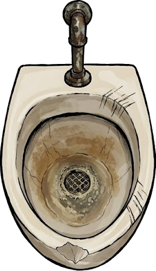

# 🚽 The King of Piss-oirs

**[🎮 Play Demo Online](https://vilda007.github.io/KingOfPissoir/)**

**The ultimate social strategy game about urinal etiquette!**



## 🎮 About the Game

**The King of Piss-oirs** is a multiplatform puzzle/strategy game that tests your knowledge of unwritten social rules in men's restrooms. You know, those awkward moments when you walk into a restroom and have to choose where to stand...

### The Problem

You're a man. You enter a restroom. There are pissoirs. Some are occupied. Some are free. Where do you stand?

- **Too close to the door?** Everyone will walk behind you.
- **Right next to another guy?** Awkward eye contact guaranteed.
- **In the middle of a crowd?** Social nightmare.

### The Goal

Master the art of **urinal distance**! Choose the correct pissoir based on:
- Distance from the door
- Distance from other "occupants"
- The sacred **one-space rule**
- Social dynamics

Navigate through **8 levels of difficulty** with increasing complexity:
- **Level 1**: Basic instinct - just stay far from the door
- **Level 2**: Tactical retreat - someone's already at the wall
- **Level 3**: Perfect symmetry - leave gaps on both sides
- **Level 4**: Buffer zones - minimal safe distances
- **Level 5**: Group dynamics - navigating clusters
- **Level 6**: Labyrinth - alternating occupied spots
- **Level 7**: Herd mentality - the worst crowds
- **Level 8**: Last resort - no good options left

### Features

✅ **28 unique scenarios** across 8 difficulty levels
✅ **7 languages** (English, Czech, Polish, German, Italian, Spanish, Ukrainian)
✅ **Dark/Light mode** - toggle industrial lighting
✅ **Timer** - track your solving speed
✅ **Educational** - learn proper restroom etiquette
✅ **Humorous descriptions** - each scenario has a funny explanation

## 🖼️ Screenshots

### Main Menu


### Gameplay
 

## 🛠️ Technology

Built with **Flutter** - Google's UI toolkit for building natively compiled applications for mobile, web, and desktop from a single codebase.

### Supported Platforms

| Platform | Status | Command |
|----------|--------|---------|
| 🌐 Web | ✅ Ready | `flutter run -d chrome` |
| 🪟 Windows | ✅ Ready | `flutter run -d windows` |
| 🤖 Android | ⚠️ Needs SDK | `flutter run` (with emulator) |
| 🍎 iOS | ⚠️ Needs Xcode | `flutter run` (with simulator) |
| 🐧 Linux | ✅ Ready | `flutter run -d linux` |
| 🍏 macOS | ✅ Ready | `flutter run -d macos` |

## 📦 Installation

### Prerequisites

- **Flutter SDK** (3.0+): [Install Flutter](https://flutter.dev/docs/get-started/install)
- **Dart SDK** (included with Flutter)
- **IDE** (optional): Android Studio, VS Code, or IntelliJ IDEA

### Quick Start

1. **Clone the repository**
```bash
git clone https://github.com/yourusername/the-king-of-piss-oirs.git
cd the-king-of-piss-oirs
```

2. **Get dependencies**
```bash
flutter pub get
```

3. **Run the game**

For **web** (fastest for testing):
```bash
flutter run -d chrome
```

For **Windows desktop**:
```bash
flutter run -d windows
```

For **Android** (requires Android emulator or device):
```bash
flutter run
```

### Building for Production

#### Web Build
```bash
flutter build web --release
```
Output: `build/web/` - deploy to any static web hosting

#### Windows Build
```bash
flutter build windows --release
```
Output: `build/windows/x64/runner/Release/`

#### Android APK
```bash
flutter build apk --release
```
Output: `build/app/outputs/flutter-apk/app-release.apk`

#### iOS (macOS only)
```bash
flutter build ios --release
```

## 🗂️ Project Structure

```
the_king_of_piss_oirs/
├── lib/
│   ├── data/
│   │   └── wc_levels.dart          # Game library (28 scenarios)
│   ├── l10n/
│   │   ├── app_en.arb              # UI translations
│   │   ├── app_cs.arb
│   │   ├── app_pl.arb
│   │   ├── app_de.arb
│   │   ├── app_it.arb
│   │   ├── app_es.arb
│   │   ├── app_uk.arb
│   │   ├── game_en.arb             # Game descriptions
│   │   ├── game_cs.arb
│   │   ├── game_pl.arb
│   │   ├── game_de.arb
│   │   ├── game_it.arb
│   │   ├── game_es.arb
│   │   └── game_uk.arb
│   ├── models/
│   │   └── wc_level.dart           # Game models
│   ├── providers/
│   │   ├── game_provider.dart
│   │   ├── settings_provider.dart  # Dark mode, language
│   │   └── wc_game_provider.dart   # Game logic
│   ├── screens/
│   │   ├── menu_screen.dart        # Main menu
│   │   └── wc_game_screen.dart     # Game screen
│   ├── utils/
│   │   ├── asset_loader.dart       # Image loading
│   │   └── game_translator.dart    # Translation service
│   └── main.dart                    # Entry point
├── media/                           # Game assets
│   ├── pissoir-1-light.png
│   ├── pissoir-2-light.png
│   ├── pissoir-3-light.png
│   ├── pissoir-4-light.png
│   ├── pissoir-5-light.png
│   ├── man-1.png
│   ├── man-2.png
│   ├── man-3.png
│   ├── man-4.png
│   ├── door-1.png
│   ├── door-2.png
│   ├── door-3.png
│   ├── door-4.png
│   ├── wall-1.png
│   ├── wall-2.png
│   ├── wall-3.png
│   ├── wall-dark.png
│   └── wall-light.png
├── pubspec.yaml                     # Dependencies
└── README.md                        # This file
```

## 🌍 Localization

The game supports 7 languages:

| Language | Code | Status |
|----------|------|--------|
| 🇬🇧 English | `en` | ✅ Complete |
| 🇨🇿 Czech | `cs` | ✅ Complete |
| 🇵🇱 Polish | `pl` | ✅ Complete |
| 🇩🇪 German | `de` | ✅ Complete |
| 🇮🇹 Italian | `it` | ✅ Complete |
| 🇪🇸 Spanish | `es` | ✅ Complete |
| 🇺🇦 Ukrainian | `uk` | ✅ Complete |

To add a new language:
1. Create `app_XX.arb` and `game_XX.arb` in `lib/l10n/`
2. Add locale to `SettingsProvider.supportedLocales`
3. Add asset to `pubspec.yaml`

## 🎨 Customization

### Adding New Levels

Edit `lib/data/wc_levels.dart`:

```dart
WcLevelConfig(
  id: 'YOURID-9A',
  difficulty: 9,
  layout: 'DXXXXOW',  // D=door, W=wall, P=free, O=occupied, X=correct
  description: 'Your hilarious description here.',
),
```

**Layout Rules:**
- Position 0: Door (D) or Wall (W)
- Position 6: Opposite of position 0 (W or D)
- Positions 1-5: Interactive cells (P, O, or X)
- One X = correct answer

### Adding Images

Place PNG files in `media/` and register them in `pubspec.yaml`:

```yaml
assets:
  - media/your-image.png
```

## 🧪 Testing

```bash
# Run tests
flutter test

# Run with hot reload (development)
flutter run -d chrome --hot
```

## 📝 License

MIT License - feel free to use, modify, and distribute!

## 🙏 Credits

- Game concept: Based on universal male restroom experiences
- Built with: Flutter & Dart
- Graphics: AI-generated assets
- Humor: Tested on real humans

## 🐛 Known Issues

- Some users report "phantom door handle anxiety" after playing
- May cause excessive restroom planning in real life
- Side effects include: increased awareness of personal space, uncontrollable urge to explain the "one-space rule" to strangers

---

**Made with 💛 and questionable humor**

*Remember: In the game of pissoirs, you either win or you learn proper etiquette.*
